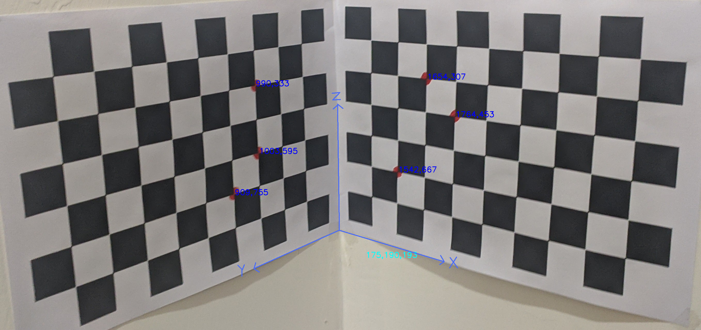

# Camera-Calibration

## Requirements:
1. Numpy
2. Pandas
3. OpenCV

## Dataset Creation
- In [CheckerBoardPoints.py](./CheckerBoardPoints.py), enter the address of the image and mark the points on the image with a mouse click.

## Procedure:
- Enter your dataset in [data/coords.csv](./data/coords.csv). Our dataset is already loaded in this file.
- Run [Camera_calibration Notebook](./Camera_calibration.ipynb) which would start calibration using the Dataset provided in [data/coords.csv](./data/coords.csv). 
- It would print the Projection Matrix m and the Intrinsic and Extrinsic parameters.
- The recovered 2D points would be stored in [data/recovered_coords.csv](./data/recovered_coords.csv).

## Recovered Points:
- The recovered points are marked back onto the image using [markRecovered.py](./markRecovered.py).
